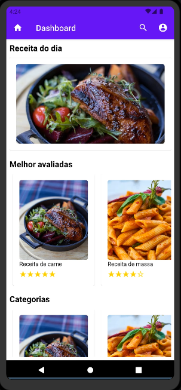
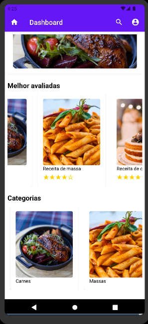

# Template Padrão da Aplicação

No momento da aplicação, essas são as telas padrão da aplicação:

# Tela de Login e Criação de Conta

 

A tela de login da aplicação, assim como as demais páginas, foram criadas em uma fórmula projetada para ser agradável e funcional. Seu objetivo é proporcionar uma experiência fluída e intuitiva ao usuário.

# Dashboard da Aplicação

 

O _dashboard_ visa atender a finalidade do projeto que é o desenvolvimento de uma aplicação simples e de fácil interatividade dos usuários.

# Tela de Visualização de Receita

A tela em questão foi feita de forma a informar, da melhor maneira ao usuário, os passos necessários para a receita.
